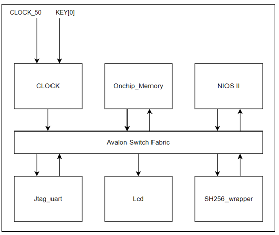
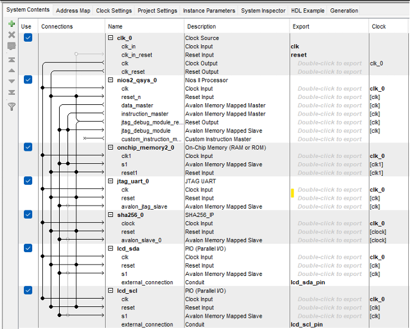
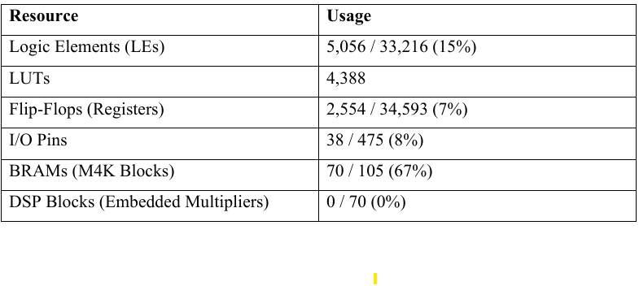
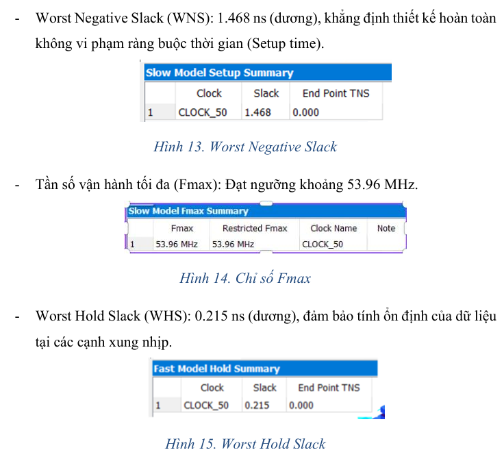

## 1. System Overview & Architecture

### 1.1. SHA-256 Hardware Accelerator IP Core
* **Algorithm Specifications:** Fully compliant with the FIPS 180-4 (NIST) standard, featuring a 512-bit block size, a 256-bit output message digest, and a 32-bit word size.
* **Architectural Optimization:** Instead of sequential processing at 1 round per clock cycle (which requires 64 standard cycles), the hardware core employs a parallel architecture consisting of two cascaded combinational round blocks (`sha256_round_comb`).
* **Execution Cycles:** Thanks to the parallel processing of 2 rounds per clock cycle, the main loop counter (`round_ctr`) only needs to iterate from 0 to 31 (32 cycles). Accounting for internal pipeline stages such as data loading and latching, the total processing time to complete a single 512-bit block is optimized down to a maximum of **36 clock cycles**.

### 1.2. SoC Integration via Qsys

The SoC system utilizes the Avalon Switch Fabric bus to interconnect the soft-core processor and its peripherals:
* **Nios II Processor:** Handles high-level software control, executes message preprocessing (parsing and bit padding), manages hardware execution flow via polling mechanisms, and outputs the final results.
* **On-chip Memory:** Stores the standalone C execution code, input data buffers, and computed hash results.
* **JTAG UART:** Facilitates hardware debugging interfaces and streams real-time logs to the Host Console.
* **PIO Peripherals:** Controls 2 dedicated GPIO pins (SDA, SCL) to implement a software bit-banged I2C protocol for communicating with the external LCD display.
* **SHA256 Wrapper (`sha_avalon_top`):** Acts as a hardware abstraction bridge, translating the internal IP Core signals into the standard **Avalon Memory-Mapped (Avalon-MM)** slave interface protocol.

---

## 2. Memory Address Map (Register Map)
The system manages data transaction flow through an address decoder comprising a total of **25 32-bit registers**:

| Address (Offset) | Mode (R/W) | Register Name / Function | Detailed Description |
| :---: | :---: | :--- | :--- |
| **0 – 15** | Write | `block_in` registers | Input message buffer holding the 512-bit data block (16 words × 32 bits). |
| **16** | Write | `Ctrl Register` | Writes a dedicated value to assert the hardware `init` flag to trigger a hash calculation cycle. |
| **16** | Read | `Status Register` | Reflects the operational status flags (`digest_valid`, `ready`, `done_reg`) for Nios II CPU polling. |
| **17 – 24** | Read | `digest_out` registers | Output registers storing the final computed 256-bit encrypted message digest (8 words × 32 bits). |

---

## 3. Software Implementation
* **Endianness Conversion:** Since the Nios II CPU operates natively on a Little-Endian architecture while the SHA-256 algorithm demands a Big-Endian format, the C firmware integrates a dedicated byte-swapping function `be_word()` to correctly reorder input words before loading them into the hardware bus.
* **Message Padding:** The system integrates a Finite State Machine (FSM) consisting of 6 processing states to split arbitrary input message streams into standardized 512-bit blocks. This includes appending the mandatory '1' bit, padding trailing zeros (`0x00`), and embedding the original message bit-length as a 64-bit integer at the final block's footer.
* **Result Display:** Implements a software bit-banged I2C protocol driver via PIO pins to interface with a 16x2 LCD module. An automated page-switching routine flips the screen view every 0.8 seconds to sequentially display the full 256-bit hex hash string.

---

## 4. Hardware Synthesis Results & Performance

### 4.1. Resource Utilization on Altera Cyclone II FPGA (DE2 Kit)

### 4.2. Timing Analysis & Real-World Performance
The design successfully met all strict setup and hold timing constraints across worst-case operating parameters:

* **Maximum Operational Frequency ($F_{max}$):** Reaches up to **53.96 MHz**.
* **System Throughput:** Achieves **767.43 Mbps**.

$$\text{Throughput} = \frac{\text{Data Block Size (512 bits)} \times F_{max}\text{ (53.96 MHz)}}{\text{Clock Cycles per Block (36 cycles)}} \approx 767.43\text{ Mbps}$$

---

## 5. Hardware/Software Co-Verification Scenarios
The functional integrity and accuracy of the SoC system were verified through real-world hardware testing and matched 100% against international standard cryptographic test vectors using three distinct boundaries:

1. **Single-Block Vector (Short Input):** Verifying a 3-byte standard string `"abc"`. The system computes the correct hash and drives the payload simultaneously to the JTAG Debug Terminal and the LCD screen.
.png)
2. **Boundary Single-Block Vector:** Evaluating a 55-byte message containing repeating `'a'` characters to stress-test the edge case of message padding fitting inside a solitary 512-bit block.
.png)
3. **Multi-Block Vector (Extended Input):** Executing a 65-byte message of repeating `'a'` characters to force the software and hardware pipeline to handle multi-block loop scheduling, verifying correct hash chaining variables across subsequent blocks.
.png)
